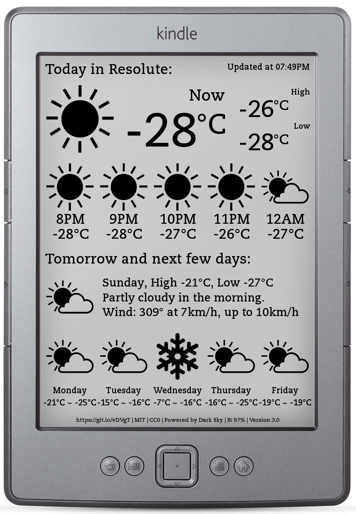

# Kindle (Non Touch) → Weather Clock — Build Guide

End-to-end guide for turning a **stock Kindle 4 / 5 Non-Touch into a standalone weather display.

Based on [x-magic/kindle-weather-stand-alone](https://github.com/x-magic/kindle-weather-stand-alone).

## Device compatibility

| | |
|---|---|
| Model | Kindle 4 or 5 Non-Touch |
| Firmware | 4.1.4 (top of supported jailbreak range 4.0.0–4.1.4) |

> ⚠️ **The only real brick risk** in this whole process is jailbreaking *out-of-range*
> firmware. 4.1.4 is in range, so you're safe. If you ever factory-reset and the firmware
> changes, re-check before re-jailbreaking.

---

## Key principles

### Project usage & core behaviors
- **Standalone, no server.** Unlike the sister project, the Kindle itself fetches the weather
  and draws the screen — nothing else on your network is involved.
- **Pull-on-a-timer loop.** Each cycle: wake → Wi-Fi on → fetch OpenWeatherMap → render
  `SVG → PNG → eips` (e-ink) → Wi-Fi off → deep-sleep until the RTC alarm (default: hourly).
- **Battery-first.** The loop deliberately stops OS services (framework, powerd, etc.) and
  deep-sleeps between updates, so a single charge lasts weeks. Lower the refresh frequency in
  `start.sh` to last even longer.
- **Stateless & config-driven.** Every cycle re-reads `weather.conf` and re-fetches live data;
  there's no local database. Change location/units by editing `weather.conf` — never the code.
- **Fail-safe display.** On problems it prints an explicit message (`NO INTERNET CONNECTION`,
  `COULD NOT UPDATE WEATHER`, `CHARGE BATTERY NOW`) instead of going blank.
- **Easy off-switch.** A `disable` file halts the loop; the app is launched manually from KUAL
  (never auto-started), so a reboot always returns a normal Kindle.

### Kindle installation — why each layer
A stock Kindle is a locked appliance that only runs Amazon-signed code. Each layer unlocks the
next, following *least privilege*: add only what's needed to run our app.
- **Why jailbreak?** It installs a developer public key so the device will accept
  unsigned/developer-signed packages. That's *all* it does — it opens the door, nothing more.
- **Why KUAL?** There's no built-in way to launch custom programs. KUAL (Kindle Unified
  Application Launcher) is the menu that lists our extension and runs its `start.sh`.
- **Why dev certs (MKK / 2025 keystore)?** KUAL is itself an unsigned Java *kindlet*. Running a
  kindlet requires the device to *trust* a developer certificate (separate from the update
  key the jailbreak installed). On modern K4 units the 2014 MKK is insufficient — the **2025
  keystore** installs the cert that fixes *"not signed by an authorized developer."*
- **Why Python?** The weather logic (HTTP calls, JSON parsing, timezone math, SVG templating)
  is written in **Python 2**, which stock Kindles lack. We install NiLuJe's Kindle Python; the
  `pytz` timezone library is bundled alongside the app so it always imports.

---

## Installation

Read [INSTALL.md](INSTALL.md)

## Run
Open KAUL and run *Kindle Weather Stand* program.

To prevent battery drain, all buttons and USB connection are disabled.

If you need to use the Kindle, you will have to reboot it by press power during 20 seconds.

